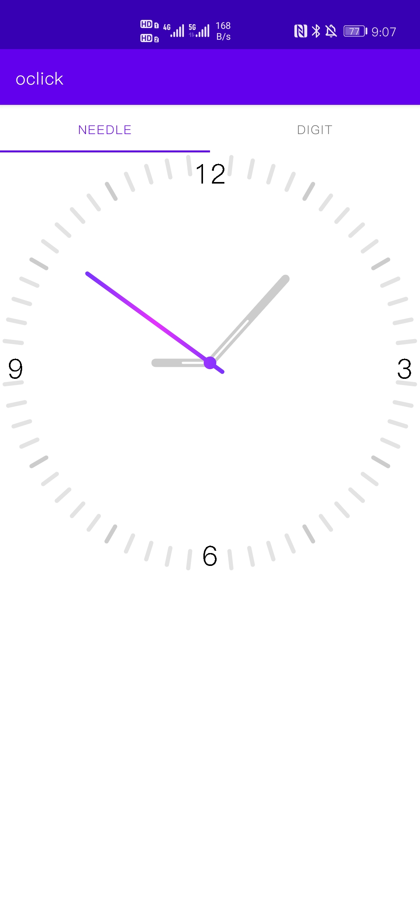
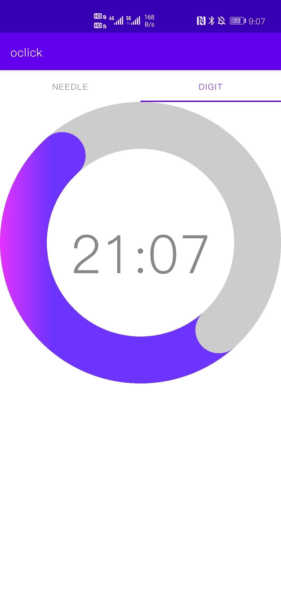

## oclock
这里有两个表。左边的是钟表，右边的也是钟表

## 所用组件

一个viewpager2,根据position不同，分别创建needleFragment（这个小驼峰。。懒得改了）和DigitFragment。

两个Fragment里分别套一个自定义view

## 特点

- 不丑
- 有tab
- viewpager之间的切换是**缩小页面转换器**，在相邻页面之间滚动时，该页面转换器会使页面收缩并淡出。随着页面越来越靠近中心，页面会恢复到正常大小并淡入。
- 数字表面参考了手机默认样式

## 效果展示

